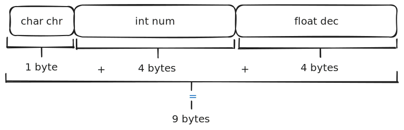
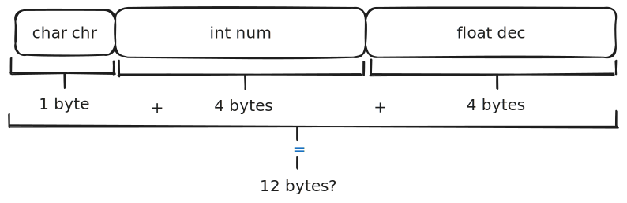
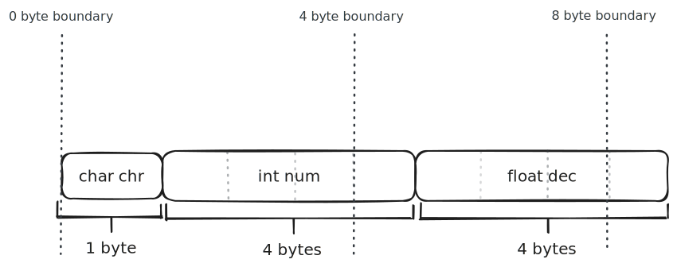
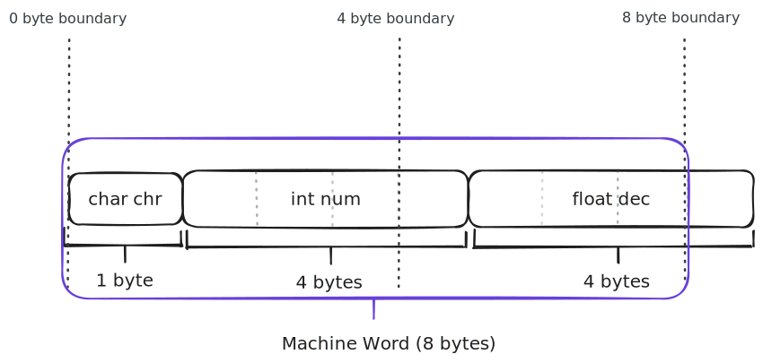
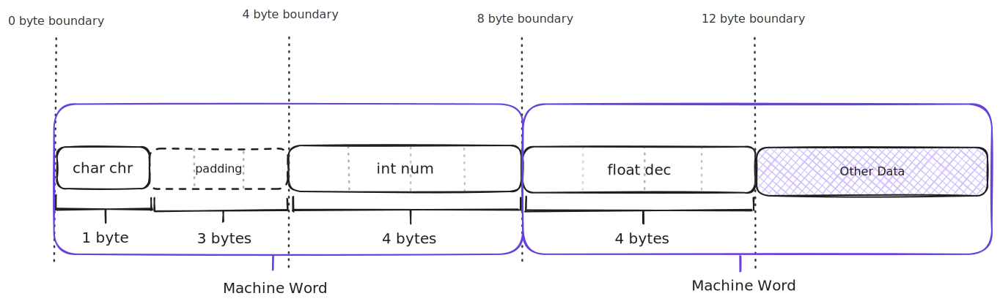

<!-- .slide: id="data-layout/1" data-auto-animate -->

## Data Layout

===

<!-- .slide: id="data-layout/2" data-auto-animate -->

## Data Layout


notes: In C++, structures will (generally) have their members located right next to each other in memory making the structure very compact. This is because one C++'s principles is to have 'Zero Cost Abstraction' meaning what you don't use you don't pay for.

===

<!-- .slide: id="data-layout/3" data-auto-animate -->

## Data Layout

```cpp [1: 1-20|9,14|10,15|11,16|12,17]
struct A {
    char chr;
    int num;
    float dec;
};

auto main() -> int {

    auto const char_sz = sizeof(char);
    auto const int_sz = sizeof(int);
    auto const float_sz = sizeof(float);
    auto const sum_sz = char_sz + int_sz + float_sz;

    std::println("char size: {} bytes.", char_sz);
    std::println("int size: {} bytes.", int_sz);
    std::println("float size: {} bytes.", float_sz);
    std::println("Sum size: {} bytes.", sum_sz);

    return 0;
}
```
<!-- .element: data-id="layout-ex" -->

<span class="fragment" style="font-size: large;">
    See it on Godbolt ⚡: <a href="https://godbolt.org/z/Y9xvPrY9r">https://godbolt.org/z/Y9xvPrY9r</a>
</span>

notes: We can check the size of a type or object using the `sizeof` operator. Here we can see that `char`, `int` and `float` have sizes of 1 byte, 4 bytes and 4 bytes respectively (x86_64 GCC) bringing their total size together to 9 bytes. That's not very big at all!

---

<!-- .slide: id="data-layout/4" data-auto-animate -->

## Data Layout



===

<!-- .slide: id="data-layout/5" data-auto-animate -->

## Data Layout

```cpp [1: 18]
struct A {
    char chr;
    int num;
    float dec;
};

auto main() -> int {

    auto const char_sz = sizeof(char);
    auto const int_sz = sizeof(int);
    auto const float_sz = sizeof(float);
    auto const sum_sz = char_sz + int_sz + float_sz;

    std::println("char size: {} bytes.", char_sz);
    std::println("int size: {} bytes.", int_sz);
    std::println("float size: {} bytes.", float_sz);
    std::println("Sum size: {} bytes.", sum_sz);
    std::println("A size: {} bytes.", sizeof(A));

    return 0;
}
```
<!-- .element: data-id="layout-ex" -->

<span class="fragment" style="font-size: large;">
    See it on Godbolt ⚡: <a href="https://godbolt.org/z/Gn8sTajnb">https://godbolt.org/z/Gn8sTajnb</a>
</span>

notes: And given that our `A` type is only made of one of each type, its size should be the same! ...but not quite. If we actually check this on Godbolt using the `sizeof` operator we can see that our structures size is 12 bytes, not 9 bytes.

---

<!-- .slide: id="data-layout/6" data-auto-animate -->

## Data Layout



notes: What? Where did the extra bytes come from?<br><br>*Take questions*

---

<!-- .slide: id="data-layout/padding" -->

### Padding

<p style="font-size: x-large;">
    Padding are empty bytes used to <em>"naturally align"</em> the memory address of datums.
</p>

<span style="font-size: x-large;"> <i>Natural Alignment</i> means that a objects' starting memory address is a multiple of its size in bytes.</span>



notes: In some situations the compiler may add empty bytes; known as padding, around member variables of a structure so that it is *"byte aligned"* or *"naturally aligned"*. This is done to help optimises the CPU's ability to read and write to the address the member is located at.

---

<!-- .slide: id="data-layout/cpu-memory-accesses" data-auto-animate -->

#### CPU Memory Accesses

<!-- auto-slide sections showing CPU reading memory one word at a time with svg's -->


notes: Why is this important? Well, it all comes down to how the CPU accesses memory.<br>When the CPU needs to work on a piece of data; whether it is an instruction or data object, it will load said data from it's cache(s) into one of its registers. When loading data, it won't just fetch the data it needs but enough data to **fill** the entire register. We actually have a name for the size of this data, it is known as *machine word* or *memory word* with each memory access fetching a single word. It is also important that the length of a word be at least as large as the largest primitive type available on the system.<!--<br><br>Why is this important to us? We are programming in a high level language, this should matter to us...except it does.--><br><br>By accessing an entire word, the CPU can fit more data it might need for the current instruction, but this can be a good thing because it can store the data in the register until it performs a new data fetch. This means that if the next instruction needs data from the previous fetch, the CPU will already have it loaded in a register ready to go, removing the need to fetch new data!

---

<!-- .slide: id="data-layout/cpu-memory-accesses/packed-data" data-auto-animate -->

#### CPU Memory Accesses

##### Packed Data



notes: Let's take a look at this using our `A` type. Let's say the next three instructions are operating on all three members of an `A` object sequentially. Let's assume the members of `A` are packed together so the types actual size is 9 bytes. The CPU will first fetch a words data (assuming 64-bit/8-byte word length) from the starting address of our `A` object. The first two instructions execute normally on `A::chr` and `A::num` but notice that we only have part of `A::dec` data. No matter, we can just fetch the remaining data right? But how would that work? How would it combine the two parts of the datum?<br><br>*Well if is too hard, couldn't it just refetch the whole datum?* But then it would have to find the address of `A` again, basically repeating the last few instructions? *I dunno how it would do it, probably just some computer magic*! The thing is, most of the time it doesn't.<br><br>Splitting data across memory word fetches makes memory accesses terribly complex. So what can be done in the codegen to account for this?

---

<!-- .slide: id="data-layout/cpu-memory-accesses/the-issue-with-packed-data" data-auto-animate -->

#### CPU Memory Accesses

##### The Issue with Packing Data


notes: Well, the compiler can shift the placement of members and datums such that members start on a memory boundary that is a power-of-2 multiple of its own size. What this does is ensure that a fetch to any (primitive) data types will store the **whole** datum in a single word, meaning that an objects data is never split across words.<br><br>If we assume that `A::chr` is 1 byte and `A::num` and `A::dec` are 4-bytes, we can see that both `A::num` and `A::dec` have a natural alignment of 4-bytes (32-bits) while `A::chr` has a natural alignment of 1-bytes (8-bits). This is what causes an issue if the data was packed together. If `A::num` and `A::dec` came right after `A::chr`, they would live on a 1-byte boundary causing misalignment.

---

<!-- .slide: id="data-layout/cpu-memory-accesses/padded-data/2" data-auto-animate -->

#### CPU Memory Accesses

##### Padded Data



notes: By adding padding after `A::chr` we have aligned `A::num` to a 4-byte boundary; it's natural alignment, which subsequently makes `A::dec` naturally aligned on the 4-byte boundary as well. One way of thinking of this is the compiler has masked `A::chr` to *appear* as if it was 4-bytes in size such that the whole structure is aligned on a 4-byte boundary. Let's see how this plays out on the CPU.

---

<!-- .slide: id="data-layout/cpu-memory-accesses/padded-data/2" data-auto-animate -->

#### CPU Memory Accesses

##### Padded Data


notes: Now the CPU has a much easier time access memory correctly as it can work through the data in a pipeline fashion.<br><br>But how does the compiler `know` what shape to give a programming language's types and structures in memory? To understand this we will need to look at how two programs interact.

===

<!-- .slide: id="data-layout/abi" data-auto-animate -->

### Application Binary Interface

---

<!-- .slide: id="data-layout/abi/apis" data-auto-animate -->

### Application Binary Interface

#### API's

<!-- Show example of source code importing a module -->

notes: When building a library you will often expose certain *symbols* which can be used in the source code of a dependant program or library. The signature of these symbols; along with the semantics imposed by the language these two programs are written in, creating the interface in which these two source code program modules can interact with each other. This is know as an API (Application Programming Interface).

---

<!-- .slide: id="data-layout/abi-ext" data-auto-animate -->

### Application Binary Interface

<!-- Show example of exe interacting with .so or other lib -->

notes: The compiled version of an API is what is known as the ABI (Application Binary Interface). An ABI is how two binary program modules (ie. compiled source code) interact with each other. The ABI is usually defined and implemented by compilers and describes how function/subroutines are executed, how types and structures get mapped to memory etc. in a systems machine code.<br><br>Therefore, how structures are mapped onto memory is described by the systems ABI such that different binary program modules can communicate and understand each other. This is essential because it is what allows your programs to interact with your Operating System (OS) which is how it is able to execute!

---

<!-- .slide: id="back-to-cpp" data-auto-animate -->

## Back to some C++

<!-- rising from CPU or binary to C++ logo -->

notes: Now that we have looked at some of the machine level details of C++'s structures lets move back into some more language level constructs.
