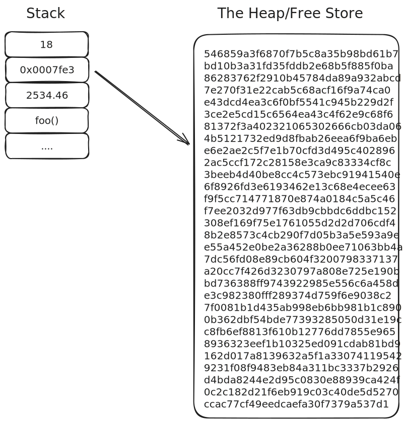
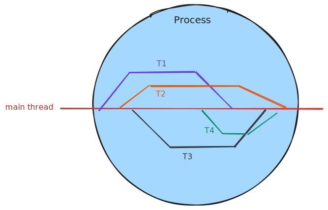
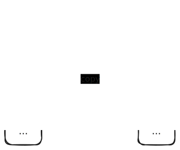
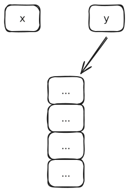
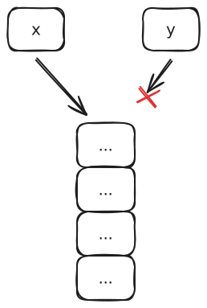

<!-- .slide: id="handling-resources" data-auto-animate -->

## Handling Resources

notes: The purpose of types in a programming language is to provide an abstraction over the binary data we are manipulating. They give meaning to the 1s and 0s that make up our systems and programs by defining valid states (combination of bits) our type can be in as well as the operations (instructions) that can be performed on them.<br><br>As we've explored, types are just the aggregation of their data members. These data members are known as resources and are held by an<!-- instance --> object of the type. This means it is the type's responsibility to *free* those resources and give them back to the system. C++ gives us a great deal of control when it come to freeing resources...for better or for worse.

===

<!-- .slide: id="handling-resources/resource-types" data-auto-animate -->

### Resource Types

- Memory<!-- .element: class="fragment fade-in-then-semi-out" style="font-size: xx-large;" -->
  - Static Memory<!-- .element: class="fragment fade-in-then-semi-out" style="font-size: xx-large;" -->
  - Automatic Memory<!-- .element: class="fragment fade-in-then-semi-out" style="font-size: xx-large;" -->
  - Dynamic Memory<!-- .element: class="fragment fade-in-then-semi-out" style="font-size: xx-large;" -->
- Files<!-- .element: class="fragment fade-in-then-semi-out" style="font-size: xx-large;" -->
- Threads<!-- .element: class="fragment fade-in-then-semi-out" style="font-size: xx-large;" -->
- Locks<!-- .element: class="fragment fade-in-then-semi-out" style="font-size: xx-large;" -->
- Sockets<!-- .element: class="fragment fade-in-then-semi-out" style="font-size: xx-large;" -->

<!-- List of different resources -->

notes: Let's first have a look at some of the resources we can obtain from the system.<br><br>

---

<!-- .slide: id="handling-resources/resource-types/memory" data-auto-animate -->

#### Memory



notes: The most common resource we can obtain is memory. All data must be stored somewhere; even the handles to the other resource types on this list, making memory the most sought after resource on a system. In general there are three types of memory available to a program; static, automatic and dynamic, with each having slightly different semantics for allocation and deallocation.<br><br>Static memory refers memory encoded directly into the executable file for a program. Static memory is allocated when the program is being executed and loaded into memory (RAM) by the kernel. Global variables and variables marked `static` are allocated as static memory.<br><br>Automatic memory or local memory is memory allocated onto the stack of a program at runtime. It is dubbed *automatic* memory because the lifetimes of these objects are managed by system. The instructions for allocating them into a stack frame is handled by the compiler and deallocation is handled by the deallocation of a whole stack frame.<br><br>Dynamic memory is memory that must be explicitly requested from the system. The lifetime of this memory is managed by the program (you) and thus must be manually returned to the system to avoid a *memory leak*. This memory often comes from a region of memory called the free store or sometimes referred to as *the heap*.

---

<!-- .slide: id="handling-resources/resource-types/files" data-auto-animate -->

#### Files

<!-- Diagram of file mapped to memory -->

notes: Some resources are acquired or obtained rather than allocated because the resource is unique. Files are one such resource because each file has a unique descriptor used to locate the file. Processes and threads are able to simultaneously hold a file's descriptor however, a file is obtained when it is opened ie. the files contents are loaded into memory with it being freed once closed.

---

<!-- .slide: id="handling-resources/resource-types/threads" data-auto-animate -->

#### Threads



notes: Threads are are another allocated resource as it is something an OS hands out specifically due to there being a finite amount available, similar to how a system has a finite amount of memory it can allocate. Threads refer to a *thread of execution* or *an execution pathway*. By default, a process runs only one thread however it is possible for a process to have multiple threads. A thread is allocated once it has been allocated its own call stack and program counter, used to load the instructions the thread is going to execute. Threads are freed once they have terminated due to exhausting their work load and have been rejoined to the main thread ie. the spawning thread.

---

<!-- .slide: id="handling-resources/resource-types/locks" data-auto-animate -->

#### Locks

<!-- Diagram showing two threads trying to access object protected by lock with one succeeding and the other attempting and failing -->

notes: A lock (or mutex) is a bit of a combination of an allocated resource and an acquired resource (at least in C++). A lock is used to prevent multiple threads or processes from accessing shared memory at the same time, preventing a race condition. Locks are usually first allocated by the system; usually due to them being implemented using hardware and OS primitives, and later are acquired or *locked* during a critical region. A lock is freed when it is *unlocked* by the locking thread or process and deallocated when a process or scope terminates and it is removed from memory by the system (provided correct memory management is applied).

---

<!-- .slide: id="handling-resources/resource-types/sockets" data-auto-animate -->

#### Sockets

<!-- Diagram of data transmitting through socket -->

notes: Sockets are a resource in a similar vein to files. A socket is usually described using *file descriptor-like* object (on Unix systems at least) meaning they can be opened to be written to or read from and closed when not in use. Unlike files, sockets have many more operations available that are used to control how the socket is used eg. binding an address to a socket or have a socket listen for incoming connections.

---

<!-- .slide: id="handling-resources/resource-types/manual-memory-management" data-auto-animate -->

#### Manual Resource Management

notes: You might observe that all of the resources describe above have a *lifetime*, some duration of time in which the resource is owned by a program or process. However, many of these resources (excluding static and stack memory) have to be manually managed ie. you must explicitly allocate or acquire the resource and once finished, explicitly free the resource. Manually managing resources is a notorious source of bugs as it can be hard to determine when the lifetime of a resource actually ends, especially when they are used in a concurrent environment where there may be multiple references to the resource.<br><br>One solution that was adopted was to introduce a parallel process that observed how objects and resources are used throughout the lifetime of the process and clean up any that are not in use. This technique is called Garbage Collection however, requiring an additional process to clean up resources can often be a no-go for programs that need to to be as efficient and fast as possible.

===

<!-- .slide: id="handling-resources/raii" data-auto-animate -->

### RAII

<!-- Diagram contrasting RAII object (mutex + lock) to non-RAII object (mutex) in terms of scope lifetime -->

notes: What if we could tie the lifetime of a resource to some *owning* object such that when the object was constructed it acquired the resource and when destroyed it freed said resources? This would allow us to create handles to resources which can live on the stack, while owning some external resource like a region of dynamic memory, a socket etc.. In this model, handles are constructed and pushed onto the stack only once all resources acquired and when the handle is popped off the stack, it frees any resources it is holding onto, ensuring that no resource lives longer than it's owning object and thus preventing leaks! This idiom is nearly as old as C++ and is named *Resource Acquisition Is Initialization* or RAII.

---

<!-- .slide: id="handling-resources/raii/value-reference-pointer-and-move-semantics" data-auto-animate -->

#### Value, Reference, Pointer and Move Semantics

notes: Before we can talk about how to utilise RAII for our own types we need to discuss semantics. Semantics are the meaning a piece of code has in a programming language. The semantics of different expressions are important to understand as they describe how resources are copied, referenced or transferred between objects.

---

<!-- .slide: id="handling-resources/raii/value-reference-pointer-and-move-semantics/value-semantics/1" data-auto-animate -->

##### Value Semantics



---

<!-- .slide: id="handling-resources/raii/value-reference-pointer-and-move-semantics/value-semantics/2" data-auto-animate -->

##### Value Semantics

```cpp
                       auto x = 123;  // x = 123
                       auto y = x;    // y = 123
                       x == y;        // true
                       &x == &y;      // false
```
<!-- .element: class="fragment" data-id="semantics-ex1" -->

<span class="fragment" style="font-size: large;">See it on Godbolt ⚡:<a href="https://godbolt.org/z/5Prroaqr1">https://godbolt.org/z/5Prroaqr1</a></span>

notes: By default, C++ expressions have value semantics (or copy semantics) meaning that the resulting value of an expression is copied or duplicated when bound to a new object. Take the example (above), the semantics of `=` here are to bind the value from the RHS to the label (variable) on the LHS by copying the underlying data. This is true regardless of what the type is on the RHS but does depend on the type denoted on the LHS.

---

<!-- .slide: id="handling-resources/raii/value-reference-pointer-and-move-semantics/reference-semantics/1" data-auto-animate -->

##### Reference Semantics


---

<!-- .slide: id="handling-resources/raii/value-reference-pointer-and-move-semantics/reference-semantics/2" data-auto-animate -->

##### Reference Semantics

```cpp
                       auto x = 123;  // x = 123
                       auto& y = x;   // y = 123
                       auto z = y;    // z = 123
                       x == y;        // true
                       &x == &y;      // true
                       x == z;        // true
                       &x == &z;      // false

```
<!-- .element: data-id="semantics-ex1" -->

<span class="fragment" style="font-size: large;">See it on Godbolt ⚡: <a href="https://godbolt.org/z/5njr3nM6Y">https://godbolt.org/z/5njr3nM6Y</a></span>

notes: C++ allows you to introduce reference semantics as a second class type. Reference semantics are probably the type of semantics you are most familiar with as they are very popular in GC languages. In GC languages, a variables is implicitly a reference to an object; rather than being the object itself, with no way to explicitly dereference or follow the reference, it is all automatic. When you copy a reference in a GC language, it doesn't copy the underlying object, just the reference to it.<br><br>References in C++ operate in a similar way to GC languages except that you must explicitly denote when an object's type is a reference type otherwise value semantics will be used. We can see observe this in the example (above). First we create a reference to `x`, `y` and then bind a non-reference `z` to `y`. We can see that C++ sees `x` and `y` as the same object, ie. `y` is really just an alias to the object `x` however, because `z` is not a reference type the value of `x` was copied through `y` into a new object `z`.

---

<!-- .slide: id="handling-resources/raii/value-reference-pointer-and-move-semantics/reference-semantics/3" data-auto-animate -->

##### Reference Semantics

```cpp
                   auto x = 123;           // x = 123
                   auto& y = x;            // y = 123
                   y = 456;                // z = 123
                   x == y;                 // true
                   &x == &y;               // true
                   std::println("{}", x);  // 456

```
<!-- .element: data-id="semantics-ex1" -->

notes: It is important to note that references in C++ cannot be rebound, if you assign to an existing reference it will mutate the referred to object.

<span class="fragment" style="font-size: large;">See it on Godbolt ⚡: <a href="https://godbolt.org/z/edj1Tc9Wj">https://godbolt.org/z/edj1Tc9Wj</a></span>

---

<!-- .slide: id="handling-resources/raii/value-reference-pointer-and-move-semantics/pointer-semantics/1" data-auto-animate -->

##### Pointer Semantics


---

<!-- .slide: id="handling-resources/raii/value-reference-pointer-and-move-semantics/pointer-semantics/2" data-auto-animate -->

##### Pointer Semantics

```cpp
                       auto x = 123;  // x = 123
                       auto* y = &x;  // y -> x
                       auto z = y;    // z -> x
                       x == *y;       // true
                       &x == y;       // true
                       x == *z;       // true
                       &x == z;       // true
                       y == z;        // true


```
<!-- .element: data-id="semantics-ex1" -->

<span class="fragment" style="font-size: large;">See it on Godbolt ⚡: <a href="https://godbolt.org/z/8fxPjKT1d"></a>https://godbolt.org/z/8fxPjKT1d</span>

notes: Pointers allow us to achieve reference semantics as well however pointers themselves store data, that being some memory address. Because of this, any operation performed on the pointer object directly will affect the pointer; not the pointed-to object. You must instead dereference a pointer using the indirection operator (prefix `*`) in order to access the object at the stored address. Notice in the example that assigning from a pointer will copy the pointer/address even though we haven't designated `z` is a pointer type like we did with `y` (can talk about `auto` type deduction).

---

<!-- .slide: id="handling-resources/raii/value-reference-pointer-and-move-semantics/pointer-semantics/3" data-auto-animate -->

##### Pointer Semantics

```cpp
                       auto x = 123;  // x = 123
                       auto* y = &x;  // y -> x
                       auto z = *y;   // z = 123
                       *y == z;       // true
                       &x == y;       // true

                       y = &z;        // y -> z
                       &x == y;       // false
                       &z == y;       // true
                       *y == x;       // true


```
<!-- .element: data-id="semantics-ex1" -->

<span class="fragment" style="font-size: large;">See it on Godbolt ⚡: <a href="https://godbolt.org/z/7a3vfrrn9">https://godbolt.org/z/7a3vfrrn9</a></span>

notes: Unlike references, pointers can be rebound to store a different address. This will change which object is access through the indirection operator.

---

<!-- .slide: id="handling-resources/raii/value-reference-pointer-and-move-semantics/move-semantics/1" data-auto-animate -->

##### Move Semantics



---

<!-- .slide: id="handling-resources/raii/value-reference-pointer-and-move-semantics/move-semantics/2" data-auto-animate -->

##### Move Semantics



---

<!-- .slide: id="handling-resources/raii/value-reference-pointer-and-move-semantics/move-semantics/3" data-auto-animate -->

##### Move Semantics

```cpp
                  auto x = "abc"s;          // x = "abc"
                  std::println("{:?}", x);
                  
                  auto y = std::move(x);    // y <- x
                  std::println("{:?}", x);  // x = ""
                  std::println("{:?}", y);  // y = "abc"


```
<!-- .element: data-id="semantics-ex1" -->

notes: Compared to reference and pointer semantics; which are used to share a resource, move semantics use used when we wish to transfer ownership of a resource. In this example we have constructed a string `x`. We then transfer or *move* ownership of any resources; in this case memory and data, from `x` to `y` and observe that now `y` owns that data previously found in `x` and with `x` itself is empty.

===

<!-- .slide: id="handling-resources/constructors-and-destructors" -->

### Constructors and Destructors

notes: So how to we implement RAII for our own types? All types have two sets of special member functions that are invoked when an object of a given type is created and destroyed. These are known as constructors and destructors respectively.

---

<!-- .slide: id="handling-resources/constructors-and-destructors/constructors" -->

#### Constructors

```cpp
                    name_of_type(T1 p1, T2 p2...) {
                        /* ... constructor body ... */
                    }
```

notes: The signature of a constructor is a function with the same signature as the type itself and has no return syntax.

---

<!-- .slide: id="handling-resources/constructors-and-destructors/constructors/default-constructor" data-auto-animate -->

##### Default Constructor

```cpp [1: 4-9|21,23,24]
struct A {
public:

    A()
    {
        this->chr = char {};
        this->num = int {};
        this->dec = float {};
    }

    auto to_string() const -> std::string { /* ... */ }

private:
    char chr;
    int num;
    float dec;
};

auto main() -> int {

    auto const a = A { };

    fmt::println("{}", a.to_string());
    // { .chr = '', .num = 0, .dec = 0.00 }

    return 0;
}
```
<!-- .element: data-id="constructors-ex1" -->

<span class="fragment" style="font-size: large;">See it on Godbolt ⚡: <a href="https://godbolt.org/z/Y8Mj5Y1YG">https://godbolt.org/z/Y8Mj5Y1YG</a></span>

notes: The most common constructor is the default constructor. This is a constructor that takes no arguments and is used to initialise a type in it's default state. The body of the default constructor is usually used to either default initialise the data members of the type or give a default initial value to said members if they cannot themselves be default constructed or the requirements of the members details different defaults. Default constructors are implicitly declared for all types however, they will not default initialise members. This example showcases a default constructor for our `A` type.

---

<!-- .slide: id="handling-resources/constructors-and-destructors/constructors/converting-constructor" data-auto-animate -->

##### Converting Constructor

```cpp [1: 11-16|28-29|31-32,34-35]
struct A {
public:

    A()
    {
        this->chr = char {};
        this->num = int {};
        this->dec = float {};
    }

    A(char chr, int num, float dec)
    { 
        this->chr = chr;
        this->num = num;
        this->dec = dec;
    }

    auto to_string() const -> std::string { /* ... */ }

private:
    char chr;
    int num;
    float dec;
};

auto main() -> int {

    auto const a = A { 'a', 123, 3.14f };
    auto const b = A { 'b', 456, 6.28f };

    fmt::println("{}", a.to_string());
    // { .chr = 'a', .num = 123, .dec = 3.14 }

    fmt::println("{}", b.to_string());
    // { .chr = 'b', .num = 456, .dec = 6.28 }

    return 0;
}
```
<!-- .element: data-id="constructors-ex1" -->

<span class="fragment" style="font-size: large;">See it on Godbolt ⚡: <a href="https://godbolt.org/z/a3YrW9h9z">https://godbolt.org/z/a3YrW9h9z</a></span>

notes: You may notice that we still cannot edit our types members, even when it is constructed. This isn't really desireable as we want users to be able to express lot's of different values with our type. To allow our type to be constructed with different values for it's data members we can define a Converting Constructor. These are constructors that usually take some arbitrary number of parameters that are used to directly construct the type. In our case we take three arguments for each of `A` data members and use these values to directly initialise our members.

---

<!-- .slide: id="handling-resources/constructors-and-destructors/constructors/constructor-initialiser-lists" data-auto-animate -->

###### Constructor Initialiser Lists

```cpp [1: 4-6,8-10|5,9]
struct A {
public:

    A()
    : chr {}, num {}, dec {}
    { }

    A(char chr, int num, float dec)
    : chr { chr }, num { num }, dec { dec }
    { }

    auto to_string() const -> std::string { /* ... */ }

private:
    char chr;
    int num;
    float dec;
};

auto main() -> int {

    auto const a = A { 'a', 123, 3.14f };
    auto const b = A { 'b', 456, 6.28f };

    fmt::println("{}", a.to_string());
    // { .chr = 'a', .num = 123, .dec = 3.14 }

    fmt::println("{}", b.to_string());
    // { .chr = 'b', .num = 456, .dec = 6.28 }

    return 0;
}
```
<!-- .element: data-id="constructors-ex1" -->

<span class="fragment" style="font-size: large;">See it on Godbolt ⚡: <a href="https://godbolt.org/z/nno15dGGd">https://godbolt.org/z/nno15dGGd</a></span>

notes: Because initialising members is such a common task of constructors, C++ offers a special syntax known as *member initialiser lists* that allows us to initialise data members more directly. Note you can still perform computation with the constructor body when using member initialiser lists eg. you may initialise a member with a dummy value in the member initialiser list and then do some post processing in the constructor body to set the correct initial value.

---

<!-- .slide: id="handling-resources/constructors-and-destructors/constructors/copy-constructors" data-auto-animate -->

##### Copy Constructor

```cpp [1: 12-16|28-29|31-32,34-35]
struct A {
public:

    A()
    : chr {}, num {}, dec {}
    { }

    A(char chr, int num, float dec)
    : chr { chr }, num { num }, dec { dec }
    { }

    A(A const& other)
    : chr { other.chr }
    , num { other.num }
    , dec { other.dec }
    { }

    auto to_string() const -> std::string { /* ... */ }

private:
    char chr;
    int num;
    float dec;
};

auto main() -> int {

    auto const a = A { 'a', 123, 3.14f };
    auto const b = A { a };  // Invokes copy constructor

    fmt::println("{}", a.to_string());
    // { .chr = 'a', .num = 123, .dec = 3.14 }

    fmt::println("{}", b.to_string());
    // { .chr = 'a', .num = 123, .dec = 3.14 }

    return 0;
}
```
<!-- .element: data-id="constructors-ex1" -->

<span class="fragment" style="font-size: large;">See it on Godbolt ⚡: <a href="https://godbolt.org/z/1ar7TEfE1">https://godbolt.org/z/1ar7TEfE1</a></span>

notes: But what if we want to copy the data from one object to another. Which constructor get's invoked? None of the ones we have declared thus far. We need to denote a new constructor with particular semantics to denote we want a copy. What argument could we pass to a constructor that could only mean we want to copy the data of the other object? A constant reference to `A` would do the trick. We cannot modify a constant and we aren't using a copy to read the `A` but instead a reference. Using `const` also means non-constant objects can also be copied as they are promoted to constant for the duration of the constructor.

---

<!-- .slide: id="handling-resources/constructors-and-destructors/constructors/move-constructors" data-auto-animate -->

##### Move Constructor

```cpp [1: 18-26|38-41|43-49]
struct A {
public:

    A()
    : chr {}, num {}, dec {}
    { }

    A(char chr, int num, float dec)
    : chr { chr }, num { num }, dec { dec }
    { }

    A(const A& other)
    : chr { other.chr }
    , num { other.num }
    , dec { other.dec }
    { }

    A(A&& other)
    : chr { std::move(other.chr) }
    , num { std::move(other.num) }
    , dec { std::move(other.dec) }
    {
        other.chr = char { }
        other.num = int { }
        other.dec = float { }
    }

    auto to_string() const -> std::string { /* ... */ }

private:
    char chr;
    int num;
    float dec;
};

auto main() -> int {

    auto a = A { 'a', 123, 3.14f };

    fmt::println("{}", a.to_string());
    // { .chr = 'a', .num = 123, .dec = 3.14 }

    auto const b = A { std::move(a) };  // Invokes move constructor

    fmt::println("{}", a.to_string());
    // { .chr = '', .num = 0, .dec = 0.00 }

    fmt::println("{}", b.to_string());
    // { .chr = 'a', .num = 123, .dec = 3.14 }

    return 0;
}
```
<!-- .element: data-id="constructors-ex1" -->

<span class="fragment" style="font-size: large;">See it on Godbolt ⚡: <a href="https://godbolt.org/z/T8a8bnovW">https://godbolt.org/z/T8a8bnovW</a></span>

notes: What about those move semantics you were talking about earlier, how do I get those? Well using another constructor that semantically means to move ownership of data. This constructor is declared with an argument of type `A&&` which denotes an rvalue reference. Rvalue references are, well, references to values we do not care about, ie. temporary values or objects we do not care about anymore, usually because we are transferring ownership of it's data to another object. Creating a rvalue reference is the job of the `std::move()` free function. Note that we have to make the object `a` non-const so that we can access the move constructor. A constant object is not allowed to be moved as this could mean mutating it which `const` forbids (look at move ctor signature).

---

<!-- .slide: id="handling-resources/constructors-and-destructors/constructors/copy-and-move-assignments" data-auto-animate -->

##### Copy and Move Assignments

```cpp [1: 28-36|38-50|64-70|72-78]
struct A {
public:

    A()
    : chr {}, num {}, dec {}
    { }

    A(char chr, int num, float dec)
    : chr { chr }, num { num }, dec { dec }
    { }

    A(const A& other)
    : chr { other.chr }
    , num { other.num }
    , dec { other.dec }
    { }

    A(A&& other)
    : chr { std::move(other.chr) }
    , num { std::move(other.num) }
    , dec { std::move(other.dec) }
    {
        other.chr = char { }
        other.num = int { }
        other.dec = float { }
    }

    auto operator= (A const& other) -> A& {
        if (*this != other) {
            this->chr = other.chr;
            this->num = other.num;
            this->dec = other.dec;
        }

        return *this;
    }

    auto operator= (A&& other) -> A& {
        if (*this != other) {
            this->chr = std::move(other.chr);
            this->num = std::move(other.num);
            this->dec = std::move(other.dec);

            other.chr = char { };
            other.num = int { };
            other.dec = float { };
        }

        return *this;
    }

    auto to_string() const -> std::string { /* ... */ }

    friend auto operator== (A const& a, A const& b) -> bool { /* ... */ }

private:
    char chr;
    int num;
    float dec;
};

auto main() -> int {

    auto a = A { 'a', 123, 3.14f };
    auto const b = a;  // Invokes copy assignment

    fmt::println("{}", a.to_string());
    // { .chr = 'a', .num = 123, .dec = 3.14 }
    fmt::println("{}", b.to_string());
    // { .chr = 'a', .num = 123, .dec = 3.14 }

    auto const c = std::move(a);  // Invokes move constructor

    fmt::println("{}", a.to_string());
    // { .chr = '', .num = 0, .dec = 0.00 }

    fmt::println("{}", c.to_string());
    // { .chr = 'a', .num = 123, .dec = 3.14 }

    return 0;
}
```
<!-- .element: data-id="constructors-ex1" -->

<span class="fragment" style="font-size: large;">See it on Godbolt ⚡: <a href="https://godbolt.org/z/cTv5MzPMe">https://godbolt.org/z/cTv5MzPMe</a></span>

notes: The final two constructors we want to define are the copy and move assignment operator overloads. These are technically just regular operator overloads but they are almost always used just to initialise an object. The signature of these functions are slightly different to the constructors, namely they require return syntax, unlike constructors but the signatures of the arguments are the same as the copy and move constructors respectively. Note that we want to ensure we are not assigning to ourselves (which would be a no-op) so we must check that our argument is not `this`. In order to do this, we must define the equality operator (`==`).

---

<!-- .slide: id="handling-resources/constructors-and-destructors/constructors/letting-the-compiler-do-the-work" data-auto-animate -->

##### Letting the Compiler Do The Work

```cpp [1: 4-5|21-22|7-9|11-19|11-19,22]
struct A {
public:

    A() = default;
    A(const A& other) = default;

    A(char chr, int num, float dec)
    : chr { chr }, num { num }, dec { dec }
    { }

    A(A&& other)
    : chr { std::move(other.chr) }
    , num { std::move(other.num) }
    , dec { std::move(other.dec) }
    {
        other.chr = char { }
        other.num = int { }
        other.dec = float { }
    }

    auto operator= (A const& other) -> A& = default;
    auto operator= (A&& other) -> A& = default;

    auto to_string() const -> std::string { /* ... */ }

    friend auto operator== (A const& a, A const& b) -> bool { /* ... */ }

private:
    char chr;
    int num;
    float dec;
};
```
<!-- .element: data-id="constructors-ex1" -->

<span class="fragment" style="font-size: large;">See it on Godbolt ⚡: <a href="https://godbolt.org/z/YEs81fjYn">https://godbolt.org/z/YEs81fjYn</a></span>

notes: Woah, that is a lot of constructors. Do we really have to write them for every type we create?! No, C++ allows us to tell the compiler to generate constructors for us. This can be particular useful when dealing with very basic structures like our `A` type. We can even do it for our assignment operators! Note that conversion constructors cannot be *defaulted* and if we wan to retain the behaviour that moves zero out our data members for `A` then we have to keep the move constructor as primitives in C++ will copy as a move due to not having true move constructors. We can still default the move assignment as it will fall back on the move constructors definition.

---

<!-- .slide: id="handling-resources/constructors-and-destructors/destructors" -->

#### Destructors

```cpp [1: 24-29]
struct A {
public:

    A() = default;
    A(const A& other) = default;

    A(char chr, int num, float dec)
    : chr { chr }, num { num }, dec { dec }
    { }

    A(A&& other)
    : chr { std::move(other.chr) }
    , num { std::move(other.num) }
    , dec { std::move(other.dec) }
    {
        other.chr = char { }
        other.num = int { }
        other.dec = float { }
    }

    auto operator= (A const& other) -> A& = default;
    auto operator= (A&& other) -> A& = default;

    ~A()
    {
        this->dec = float { };
        this->num = int { };
        this->chr = char { };
    }

    auto to_string() const -> std::string { /* ... */ }

    friend auto operator== (A const& a, A const& b) -> bool { /* ... */ }

private:
    char chr;
    int num;
    float dec;
};
```
<!-- .element: data-id="destructors-ex1" -->

<span class="fragment" style="font-size: large;">See it on Godbolt ⚡: <a href="https://godbolt.org/z/zP47besjE">https://godbolt.org/z/zP47besjE</a></span>

notes: Destructors are much more simple compared to constructors as their is only one for every type. While constructors specify how to initialise a type and acquire resources, destructors specify how to destroy and free resources. Destructors are specified by a function with the same name as the type, prefixed with a tilde (~). Destructors can be defaulted or have a body that specifies what exactly should happen when a object is destroyed. A destructor is automatically called when an object goes out of scope and will call the destructors of all data members in the reverse order they we're declared/initialised in, meaning you should never have to call a destructor manually. In the example I am explicitly zero-ing the memory that stored an `A` data members as primitives don't have destructors (zero-ed memory is easier for the system to track as unused and primitives aren't defined to zero themselves, they can but it is not guaranteed).

<!-- - Syntax
- Do not throw from a constructor! -->
