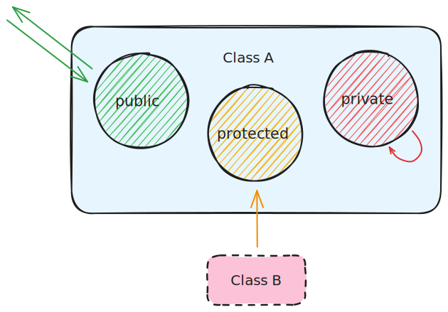

<!-- .slide: id="access-control/description" data-auto-animate -->

## Access Control



note: C++ allows us to control which members can be accessed from outside the type. This is done with access modifier labels. These will apply to any members; data or function, below the label in the types definition. Access modifiers allow use to encapsulate/internalize parts of the type so it cannot be modified by anyone outside the type itself.

---

<!-- .slide: id="access-control/table" data-auto-animate -->

## Access Control

| Specifiers   | Same Class | Derived Class | Outside Class |
|--------------|------------|---------------|---------------|
| `public`     | Yes        | Yes           | Yes           |
| `private`    | Yes        | No            | No            |
| `protected`  | Yes        | Yes           | No            |

notes: C++ has three access control labels, public, private and protected. `public` members can be accessed from anyone outside the type and is used to define the API of our type. `private` members are completely inaccessible to anything outside the type. `protected` labels members that are private to anything outside the type except for types that are a part of the same inheritance tree.<br>We will look more at `protected` when we talk about virtual polymorphism.<br><br>Types declared with the `struct` keyword will have the `public` modifier applied to the whole type by default.<br>Types declared with the `class` keyword will have the `private` modifier applied to the whole type by default.<br>This is the only difference between the `class` and `struct` keyword in C++.

---

<!-- .slide: id="access-control/example/before" data-auto-animate -->

## Access Control

```cxx [1:]
struct A {
    char chr;
    int num;
    float dec;
};

auto main() -> int {

    auto a = A { .chr = 'a', .num = 123, .dec = 3.14 };

    std::println("{}", a.chr);  // a
    std::println("{}", a.num);  // 123
    std::println("{}", a.dec);  // 3.14

    return 0;
}
```
<!-- .element: data-id="member-access-ex" -->

---

<!-- .slide: id="access-control/example/private" data-auto-animate -->

## Access Control

```cxx [1: 5-6,17|5-6|17|11-13]
struct A {
    char chr;
    int num;

private:
    float dec;
};

auto main() -> int {

    auto a = A { };
    a.chr = 'a';
    a.num = 123;

    std::println("{}", a.chr);  // a
    std::println("{}", a.num);  // 123
    std::println("{}", a.dec);  //! Now fails to compile

    return 0;
}
```
<!-- .element: data-id="member-access-ex" -->

<span class="fragment" style="font-size: large;">See it on Godbolt ⚡: <a href="https://godbolt.org/z/6PPqn9nsW">https://godbolt.org/z/6PPqn9nsW</a></span>

notes: Let's modify our `A` type from earlier by making `A::dec` private. We now get a compiler error on line 17 stating `'float A::dec' is private within this context`. Notice that we also can no longer use Aggregate Initialisation (w/wout Designated Initialisers) as we can't even access `A::dec` to initialise it! (Don't worry, we can fix this later).<br><br>But if we hide members of our structure how are we able to access them? This is where defining operations or member functions (methods) are useful.
