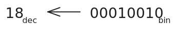
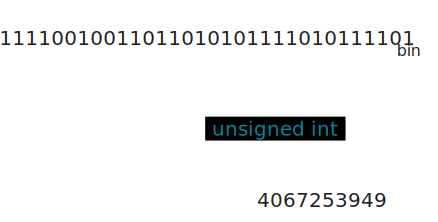

<!-- .slide: id="terminology" data-auto-animate -->

## Terminology

notes: I want to start by to quickly defining some of the terminology I will be using throughout this presentation

---

<!-- .slide: id="terminology/object" -->

### Object

When I refer to an *"object"* I am refer to a piece of data that lives in memory ie. the actual 1s and 0s that make up the piece of data. An object has *some* value which is of *some* type.

---

<!-- .slide: id="terminology/value" -->

### Value

A *"value"* is the interpretation of some collection of bits according to a type. What this means is that the same set of bits *might* have different meanings depending on whatever type they are bound by.

---

<!-- .slide: id="terminology/type" -->

### Type

    The <em>"type"</em> of some value is an abstraction within the programming language which constrains what operations and values an object can have. This includes built-in data types like <code>int</code>, <code>float</code>, <code>char</code> etc., often called POD (Plain Old Data) types in C++ as well as user-defined types introduced using the <code>class</code> and <code>struct</code> keywords.

<!-- Diagram illustrating this example: the bits `11110010011011010101111010111101` have the have the value `-227713347` when interpreted as a C `int` but have the value `4067253949` when interpreted as a C `unsigned int`. -->

---

<!-- .slide: id="terminology/identifier" -->

### Identifier

When referring to an *"identifier"* I am referring to the in-source name given to datums (variables), free functions and member functions.

<!-- Diagram of variable syntax indicating identifier, type and value. -->

---

<!-- .slide: id="terminology/system_platform" -->

### System/Platform

*"System"* or *"Platform"* refers to the Operating System (OS) kernel a computer is using in combination with any core libraries used to make a complete OS and the architecture of the CPU used to run the system.

<!-- Diagram of kernel in system stack -->

---

<!-- .slide: id="terminology/target" -->

### Target

*"Target"* refers to the type of machine code a compiler generates for a given CPU architecture from some source code.

<!-- Diagram of compiler pipeline to different targets -->

---

<!-- .slide: id="terminology/architecture" -->

### Architecture

*"(CPU) Architecture"* is the instruction set of a CPU eg. x86/x86_64, ARM etc.

===

<!-- .slide: id="notes" -->

## Notes

    Throughout these slides I will be using C++23's <code>std::print</code> and <code>std::println</code> functions. These are not widely available in compilers yet but there are mirror versions available from the <a href="https://fmt.dev">{fmt}</a> library.

    In some slides you might see <i>"See it on Godbolt ⚡:"</i> followed by a link. These take you to an online compiler instance setup to run the example which run in your browser!

